<h1>👋 Salut, je suis Alexandre </h1>

🎓 Étudiant à **42 Lyon**, spécialisation systèmes embarqués
💡 Passionné par le **développement logiciel**, l'**intelligence artificielle** et les **systèmes embarqués**.
🔧 Développeur axé sur la **qualité du code** et l'**apprentissage continu**.

## 🧠 Domaines d'intérêt
- ⚙️ **Systèmes embarqués**
- 🤖 **Intelligence Artificielle**
- 🏠 **Home Lab & domotique** (self-hosting, Home Assistant)
- 🧩 **Architecture logicielle & optimisation**

---

## 🎯 Objectif professionnel
Continuer à progresser en **C++**, en **systèmes embarqués**, et à explorer l'**intelligence artificielle** appliquée.
Je cherche à construire des logiciels **robustes, performants et intelligents**.

## 📄 Mon parcours à 42
🎓 Consulte mon **transcript officiel** :
[➡️ Télécharger mon transcript (PDF)](./profile/transcript.pdf)

---

## 💻 Langages

### 🌟 Langages principaux
<table>
<tr>
<td align="center" width="150">
  
   <b>C</b>
</td>
<td align="center" width="150">
  
   <b>C++</b>
</td>
<td align="center" width="150">
  
   <b>Python</b>
</td>
<td align="center" width="150">
  
   <b>JavaScript</b>
</td>
</tr>
</table>

### 🧩 Langages explorés
<table>
<tr>
<td align="center" width="150">
  
   <b>Java</b>
</td>
<td align="center" width="150">
  
   <b>C#</b>
</td>
<td align="center" width="150">
  
   <b>TypeScript</b>
</td>
</tr>
</table>

## 🧰 Technologies et outils

<table>
<tr>
<td align="center" width="150">
  
   <b>Zsh</b>
</td>
<td align="center" width="150">
  
   <b>Git</b>
</td>
<td align="center" width="150">
  
   <b>Docker</b>
</td>
<td align="center" width="150">
  
   <b>Makefile</b>
</td>
<td align="center" width="150">
  
   <b>JetBrains IDE</b>
</td>
<td align="center" width="150">
  
   <b>Linux</b>
</td>
<td align="center" width="150">
  
   <b>Home Assistant</b>
</td>
</tr>
</table>

## 🚀 Projets préférés

<table>
<tr>
<td align="center" width="33%">

### 🕹️ [Transcendence](https://github.com/The-mallocers/Transcendence)
> Jeu de pong multijoueur en temps réel (auth, chat, API).

</td>
<td align="center" width="33%">

### 🎛️ [SoundMapping](https://github.com/Coxyz/SoundMapping)
> Logiciel pour gérer le son de chaque application sur Windows.

</td>
<td align="center" width="33%">

### 📟 [MCSM](https://github.com/Mizu-cmd/MCSM)
> Gestion et création de serveurs Minecraft via une interface intuitive.

</td>
</tr>
</table>

## 📊 Statistiques GitHub

  
  

## ⏱️ Statistiques de codage

  

## 📫 Contact
📧 **Mon email** : [alexandre.tresallet@gmail.com](mailto:alexandre.tresallet@gmail.com)

💼 **Mon LinkedIn** : [alexandre-tresallet](https://linkedin.com/in/alexandre-tresallet/)

💡 *"La rigueur construit les fondations, la curiosité trace la voie."*
